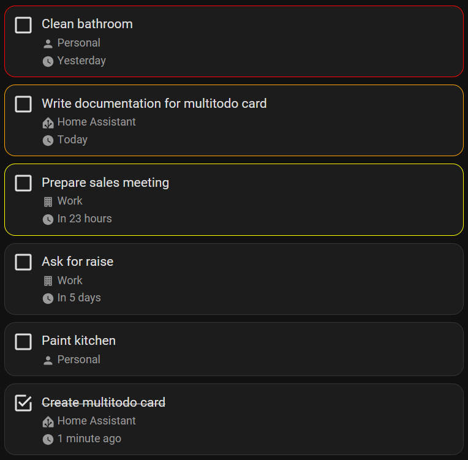

# Multi todo card


[](https://www.buymeacoffee.com/rudygnodde)

Custom Home Assistant card displaying a list of todo tasks from multiple entities



## Table of Content

- [Installation](#installation)
    - [HACS (Recommended)](#hacs-recommended)
    - [Manual](#manual)
- [Configuration](#configuration)
    - [Main options](#main-options)
    - [Entities](#entities)
- [Examples](#examples)

## Installation

### HACS (Recommended)

1. Make sure [HACS](https://hacs.xyz) is installed and working.
2. Add this repository (https://github.com/FamousWolf/multitodo) via [HACS Custom repositories](https://hacs.xyz/docs/faq/custom_repositories). Type should be `JavaScript module`.
3. Download and install using HACS.

### Manual

1. Download and copy `multitodo.js` from the [latest release](https://github.com/FamousWolf/multitodo/releases/latest) into your `config/www` directory.
2. Add the resource reference to Home Assistant configuration using one of these methods:
   - **Edit your configuration.yaml**
     Add:
     ```yaml
     resources:
       - url: /local/multitodo.js?version=0.9.0
     type: module
     ```
   - **Using the graphical editor**
    1. Make sure advanced mode is enabled in your user profile
    2. Navigate to "Settings" -> "Dashboards".
    3. Click on the 3 vertical dots in the top right corner and select "Resources".
    4. Click on the "Add resource" button in the bottom right corner.
    5. Enter URL `/local/multitodo.js` and select type "JavaScript Module".
    6. Restart Home Assistant.

## Configuration

### Main Options

| Name            | Type        | Default      | Supported options                    | Description                                           | Version |
|-----------------|-------------|--------------|--------------------------------------|-------------------------------------------------------|---------|
| type            | string      | **Required** | `custom:multitodo-card`              | Type of the card                                      | 0.9.0   |
| entities        | object list | **Required** | See [Entities](#entities)            | Entities shown in the card                            | 0.9.0   |
| overDueColor    | string      | red          | Any CSS color                        | Color for overdue items                               | 0.9.0   |
| dueColor        | string      | orange       | Any CSS color                        | Color for due items                                   | 0.9.0   |
| almostDueDays   | number      | 3            | Any integer number                   | Number of days for an item to be marked as almost due | 0.9.0   |
| almostDueColor  | string      | yellow       | Any CSS color                        | Color for almost due items                            | 0.9.0   |
| sorting         | string      | due desc     | `due asc` \| `due desc` \| `summary` | Sorting                                               | 0.9.0   |
| completedBottom | boolean     | true         | `false` \| `true`                    | Completed items at the bottom                         | 0.9.0   |
| hideOverdue     | boolean     | false        | `false` \| `true`                    | Hide overdue items                                    | 0.9.0   |
| hideDue         | boolean     | false        | `false` \| `true`                    | Hide due items                                        | 0.9.0   |
| hideAlmostDue   | boolean     | false        | `false` \| `true`                    | Hide almost due items                                 | 0.9.0   |
| hideNotDue      | boolean     | false        | `false` \| `true`                    | Hide not due items                                    | 0.9.0   |
| hideNoDueDate   | boolean     | false        | `false` \| `true`                    | Hide items without due date                           | 0.9.0   |
| hideCompleted   | boolean     | false        | `false` \| `true`                    | Hide completed items                                  | 0.9.0   |

### Entities

| Name   | Type   | Default              | Supported options | Description           | Version |
|--------|--------|----------------------|-------------------|-----------------------|---------|
| entity | string | **Required**         | `todo.my_list`    | Todo list entity ID   | 0.9.0   |
| name   | string | Entity name          | Any text          | Name of the todo list | 0.9.0   |
| icon   | string | `mdi:clipboard-list` | Any icon          | Icon of the list      | 0.9.0   |


## Examples

### Default with 2 todo list entities

```yaml
type: custom:multitodo-card
entities:
  - entity: todo.personal
    icon: mdi:account
  - entity: todo.work
    icon: mdi:briefcase
overdueColor: red
dueColor: orange
almostDueDays: 3
almostDueColor: yellow
sorting: due desc
completedBottom: true
hideOverdue: false
hideDue: false
hideAlmostDue: false
hideNotDue: false
hideNoDueDate: false
hideCompleted: false
```